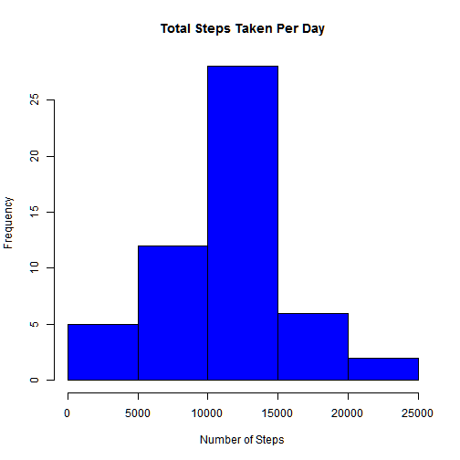
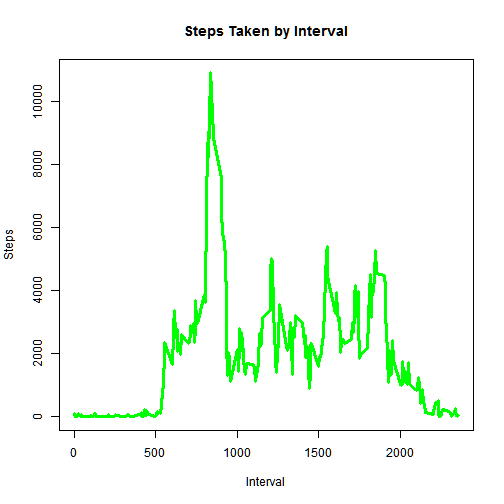
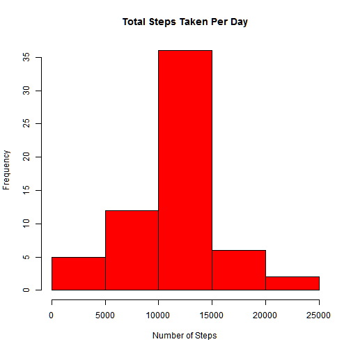
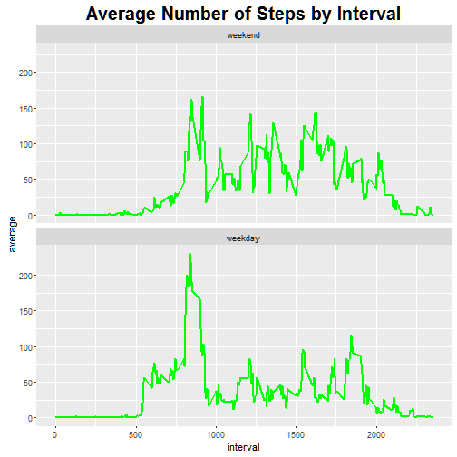

The purpose of Peer Assessment #1 is to create a report using Rmarkdown. The data is from a personal activity monitoring device.

#1. Loading and preprocessing the data

This piece of code checks whether the data folder exists in the directory. If it does not, then it downloads the file from Cloudfront into the folder, unzips it into a sub-folder, and then reads the data into the "activity" variable in R.


```r
if (!file.exists("./data")) {
    dir.create("./data")
    fileUrl <- "https://d396qusza40orc.cloudfront.net/repdata%2Fdata%2Factivity.zip"
    download.file(fileUrl, destfile = "./data/Activity.zip")
    unzip("./data/Activity.zip", exdir = "Project1")
}

activity <- read.csv("./Project1/Activity.csv", header = T)
```

#2. What is the mean total number of steps taken per day?


```r
options(scipen = 999)
act_day <- aggregate(activity$steps, by = list(activity$date), FUN = sum)
colnames(act_day) <- c("date", "steps")
mean(act_day$steps, na.rm = T)
```

```
## [1] 10766.19
```

```r
median(act_day$steps, na.rm = T)
```

```
## [1] 10765
```


As shown in the code above, the mean total number of steps taken per day is 10766 and the median total number of steps taken per day is 10765. The histogram of the distribution is shown below.


```r
hist(act_day$steps, main = "Total Steps Taken Per Day", col = "blue", xlab = "Number of Steps")
```

 

#3. What is the average daily activity pattern?
On a daily basis, there is large variation of steps taken depending on the time of the day. As shown in the plot below.


```r
act_int <- aggregate(activity$steps, by = list(activity$interval), FUN = sum, 
    na.rm = T)
colnames(act_int) <- c("Interval", "Steps")
with(act_int, plot(Steps ~ Interval, type = "l", lwd = 3, col = "green", main = "Steps Taken by Interval"))
```

 

```r
act_int[which.max(act_int$Steps), ]$Interval
```

```
## [1] 835
```

The 5-minute interval that contains the maximum number of steps is 835.

#4. Imputing missing values

First of all, the total number of missing values is 2304.

The below code copies the original data and then imputes missing values by substituting the mean of the 5-minute interval for the NA's.


```r
sum(is.na(activity$steps))
```

```
## [1] 2304
```

```r
act_int_mean <- function(x) {
    avg <- aggregate(activity$steps, by = list(activity$interval), FUN = mean, 
        na.rm = T)
    avg[is.na(avg)] <- 0
    colnames(avg) <- c("Interval", "Avg_Steps")
    avg[which(avg$Interval == x), ]$Avg_Steps
}

activity_no_NA <- activity

for (i in 1:length(activity_no_NA$steps)) {
    if (is.na(activity_no_NA$steps[i])) {
        activity_no_NA$steps[i] <- act_int_mean(activity_no_NA$interval[i])
    }
}
```

The distribution can be observed in the histogram below.


```r
total <- aggregate(activity_no_NA$steps, by = list(activity$date), FUN = sum)
colnames(total) <- c("date", "steps")
hist(total$steps, main = "Total Steps Taken Per Day", xlab = "Number of Steps", 
    col = "red")
```

 

```r
mean(total$steps)
```

```
## [1] 10766.19
```

```r
median(total$steps)
```

```
## [1] 10766.19
```

The mean of the total number of steps taken per day is now 10766 and the median is now 10766. Imputing the missing values had no effect on the mean, but it had the effect on the median of making it equal to the mean. Imputing the missing values had the additional effect of increasing the number of available observations.

#5. Are there differences in activity patterns between weekdays and weekends?

The below code creates a new factor variable to separate the effects of weekdays and weekends. The difference between weekdays and weekends can be seen in the plot below.


```r
for (i in 1:length(activity_no_NA$date)) {
    if (weekdays(as.Date(activity_no_NA$date[i])) == "Saturday") {
        activity_no_NA$weekday[i] <- "weekend"
    } else if (weekdays(as.Date(activity_no_NA$date[i])) == "Sunday") {
        activity_no_NA$weekday[i] <- "weekend"
    } else {
        activity_no_NA$weekday[i] <- "weekday"
    }
}

activity_no_NA$weekday <- as.factor(activity_no_NA$weekday)

act_int_avg <- with(activity_no_NA, aggregate(steps, by = list(interval, weekday), 
    FUN = mean))
colnames(act_int_avg) <- c("interval", "weekday", "average")

library(ggplot2)
ggplot(act_int_avg, aes(x = interval, y = average)) + facet_wrap(~weekday, ncol = 1, 
    as.table = FALSE) + geom_line(lwd = 1, color = "green") + ggtitle("Average Number of Steps by Interval") + 
    theme(plot.title = element_text(size = 20, face = "bold", vjust = 2))
```

 

library(knitr)
knit2html("PA1 Submission.Rmd", "PA1 Submission.html")
